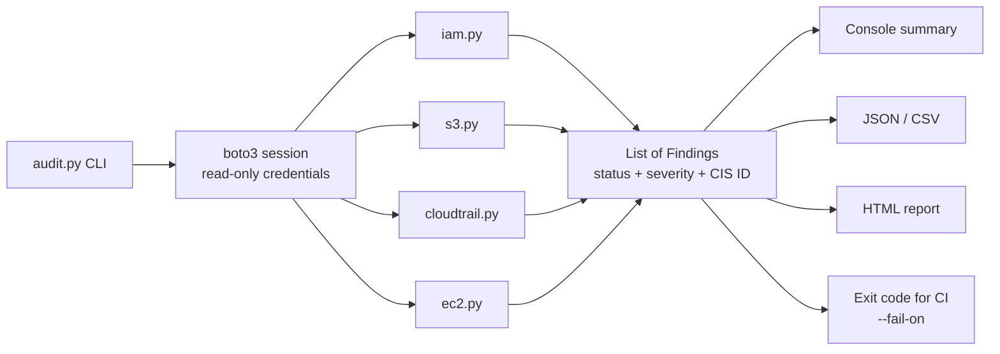

# AWS Security Baseline Auditor

Read-only Python scanner that finds the AWS misconfigurations behind most cloud
breaches — public S3 buckets, missing MFA, SSH open to the internet, no audit
trail — and maps every finding to the **CIS AWS Foundations Benchmark v5.0.0**.

It answers one question fast: *if this account were attacked today, where is it weakest?*

## What it checks

| Check | CIS v5.0.0 | Severity | What it catches |
|---|---|---|---|
| IAM-01 | 1.3 | CRITICAL | Root user has access keys |
| IAM-02 | 1.4 | CRITICAL | Root user without MFA |
| IAM-03 | 1.7 | MEDIUM | Password policy shorter than 14 characters |
| IAM-04 | 1.8 | LOW | Password reuse not prevented |
| IAM-05 | 1.9 | HIGH | Console user without MFA |
| IAM-06 | 1.13 | MEDIUM | Access key older than 90 days |
| IAM-07 | 1.11 | MEDIUM | Active access key unused for 45+ days |
| IAM-08 | 1.14 | HIGH / LOW | Policies attached directly to users (HIGH if `AdministratorAccess`) |
| S3-01 | 2.1.4 | HIGH | Account-level Block Public Access off |
| S3-02 | 2.1.4 | CRITICAL / MEDIUM | Bucket publicly accessible / Block Public Access incomplete |
| S3-03 | 2.1.1 | LOW | Bucket accepts unencrypted HTTP requests |
| CT-01 | 3.1 | CRITICAL | No multi-region CloudTrail that is actually logging |
| CT-02 | 3.2 | MEDIUM | CloudTrail log file validation off |
| EC2-01 | 5.3 / 5.4 | HIGH | SSH (22) or RDP (3389) open to `0.0.0.0/0` or `::/0` |
| EC2-02 | 5.5 | LOW | Default security group has rules |
| EC2-03 | 5.1.1 | MEDIUM | EBS encryption by default off |

## How it works



Each module returns a list of `Finding` objects (`auditor/models.py`). If a check
group hits `AccessDenied`, it is reported as `ERROR` instead of crashing — a
partial audit is more useful than none.

## Security of the tool itself

The auditor only calls `Get*`, `List*` and `Describe*` APIs. It never modifies
anything. Run it with an identity that has the AWS managed **`SecurityAudit`**
policy (read-only) — never with admin credentials.

## Installation

```bash
git clone https://github.com/Rhaave/aws-security-baseline-auditor.git
cd aws-security-baseline-auditor
python3 -m venv .venv && source .venv/bin/activate
pip install -r requirements.txt
```

## Usage

```bash
python3 audit.py                                   # default profile and region
python3 audit.py --profile audit --regions eu-central-1 us-east-1
python3 audit.py --html report.html --json report.json --csv report.csv
python3 audit.py --fail-on HIGH                    # exit 1 on any HIGH/CRITICAL failure
```

## Try it without an AWS account

A demo builds a deliberately misconfigured fake account with
[moto](https://github.com/getmoto/moto) and audits it:

```bash
pip install -r requirements-dev.txt
python3 examples/demo_moto.py
```

Sample output (the demo also writes a full HTML report to `examples/sample_report.html`):

```
AWS Security Baseline Audit - account 123456789012
Checks: 17  PASS: 3  FAIL: 14  ERROR: 0
  CRITICAL: 3
  HIGH: 4
  MEDIUM: 2
  LOW: 5
------------------------------------------------------------------------------
[FAIL] [CRITICAL] CT-01 (CIS 3.1) Multi-region CloudTrail enabled and logging
    Resource: account
    No active multi-region trail - API activity in some or all regions is not recorded.
    Fix: Create a multi-region trail and make sure logging is started.
[FAIL] [CRITICAL] S3-02 (CIS 2.1.4) Bucket is not publicly accessible
    Resource: s3://customer-exports
    Bucket policy grants public access - anyone on the internet can reach its objects.
    Fix: Remove the public statement from the bucket policy and enable Block Public Access.
[FAIL] [HIGH    ] EC2-01 (CIS 5.3/5.4) No admin ports open to the internet
    Resource: eu-central-1/sg-561bb3682d5b16722 (bastion)
    Exposed: SSH/22 from 0.0.0.0/0.
    Fix: Restrict SSH/RDP to known IP ranges or use SSM Session Manager instead.
...
```

## Tests

18 tests run against moto (in-memory AWS), no real account needed:

```bash
python3 -m pytest -q
```

## Known limitations

- Covers 16 checks, not the full benchmark (~50 recommendations), e.g. no
  KMS rotation, VPC Flow Logs, AWS Config or RDS checks yet.
- Single account; no AWS Organizations support.
- ACL-based public buckets are only caught via AWS's `GetBucketPolicyStatus`
  and Block Public Access settings, not by parsing ACLs directly.

## License

MIT
